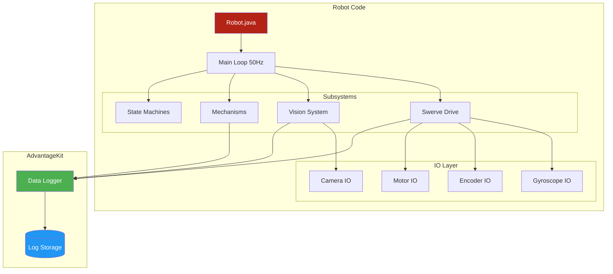
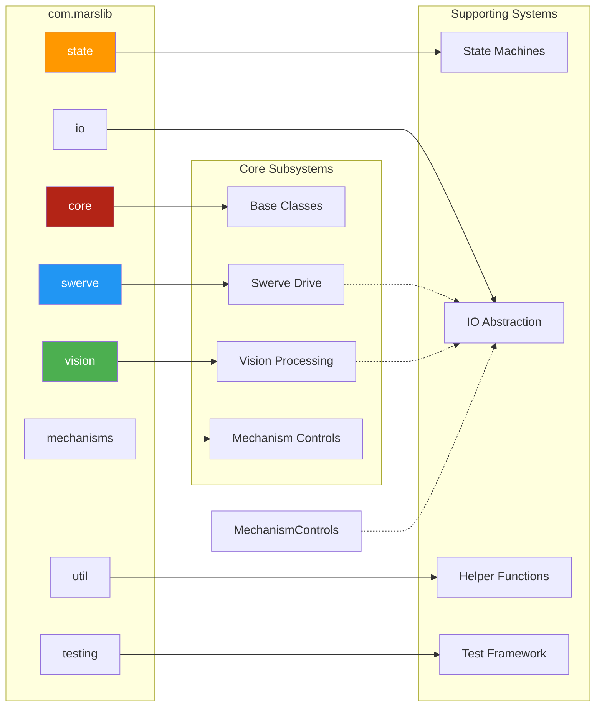
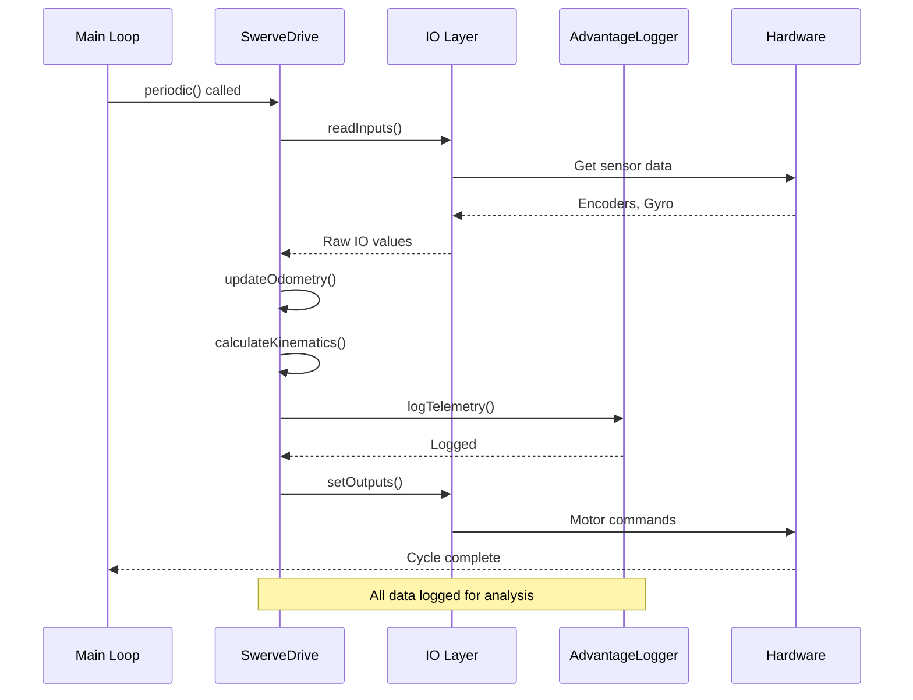
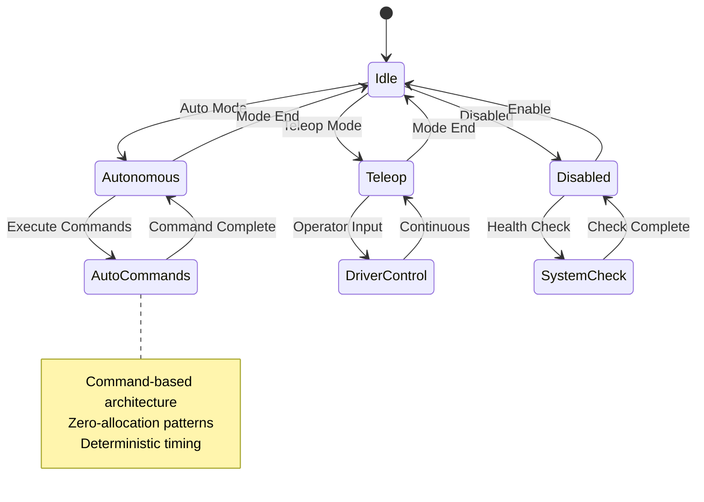
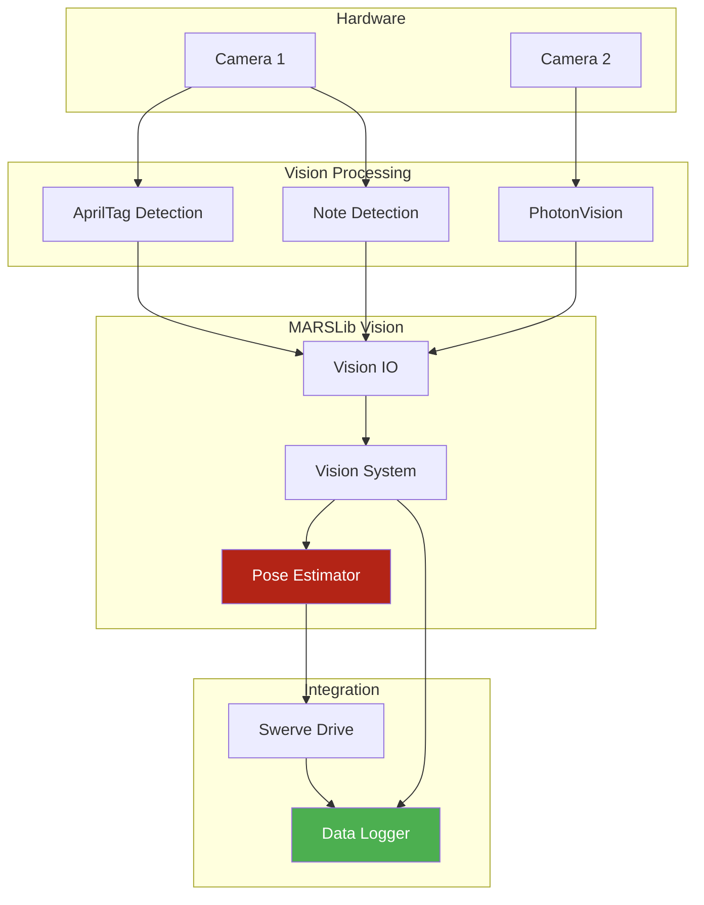
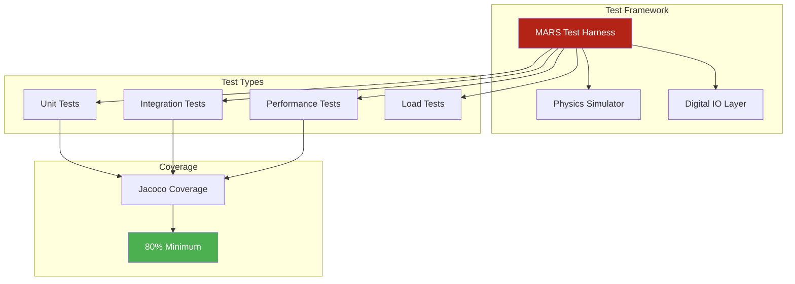
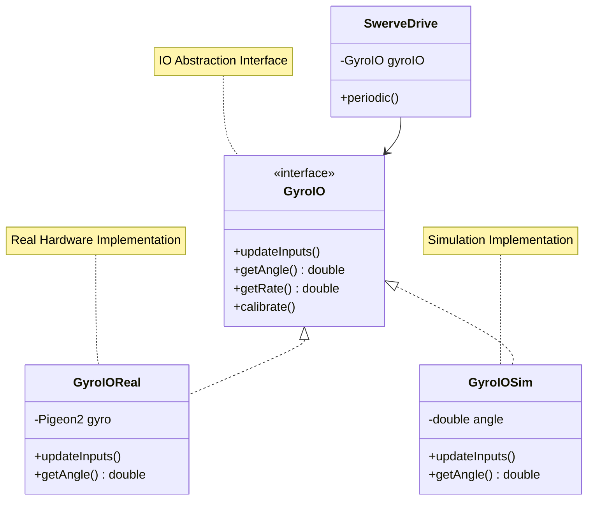
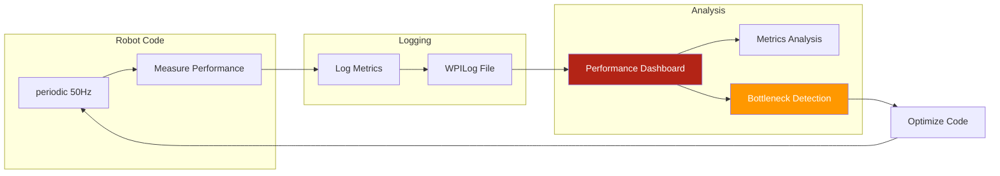
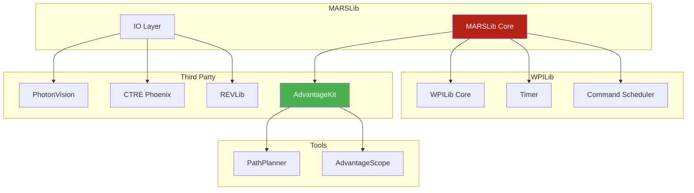

# Architecture Diagrams

This page provides visual diagrams of MARSLib's core architecture, system interactions, and data flow patterns.

## System Architecture Overview



## Package Structure



## Data Flow: Swerve Drive



## State Machine Flow



## Vision System Pipeline



## Testing Architecture



## IO Abstraction Layer



## Performance Monitoring Flow



## Memory Management

```mermaid
graph TB
    subgraph "Zero-Allocation Pattern"
        Periodic[Periodic Method]
        PreAlloc[Pre-Allocated Objects]
        ObjectPool[Object Pool]
        Reuse[Reuse Objects]
    end
    
    subgraph "Anti-Patterns"
        New1[new Double()]
        New2[new ArrayList()]
        String1[String concatenation]
    end
    
    subgraph "Monitoring"
        VisualVM[VisualVM]
        JFR[Java Flight Recorder]
    end
    
    Periodic --> PreAlloc
    Periodic --> ObjectPool
    ObjectPool --> Reuse
    Reuse --> Periodic
    
    Periodic -.x.-> New1
    Periodic -.x.-> New2
    Periodic -.x.-> String1
    
    Periodic --> VisualVM
    Periodic --> JFR
    
    style PreAlloc fill:#4CAF50,color:#fff
    style New1 fill:#F44336,color:#fff
    style New2 fill:#F44336,color:#fff
    style String1 fill:#F44336,color:#fff
```

## Integration with External Systems



---

## 📖 Further Reading

- [Framework Architecture](/tutorials/framework/architecture) - Detailed architecture discussion
- [IO Abstraction](/tutorials/framework/io-abstraction) - IO layer implementation
- [Testing Philosophy](/contributing/testing-guide) - Digital Twin testing approach
- [Performance Analysis](/tutorials/elite/performance-analysis) - Performance monitoring tools
