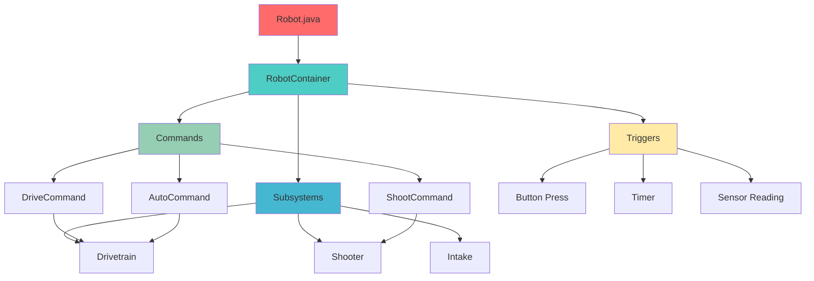
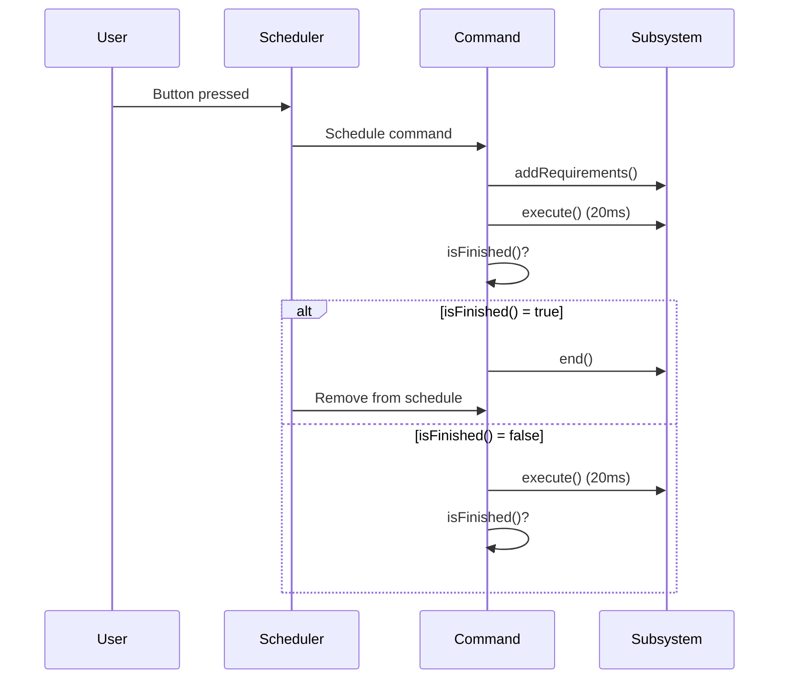
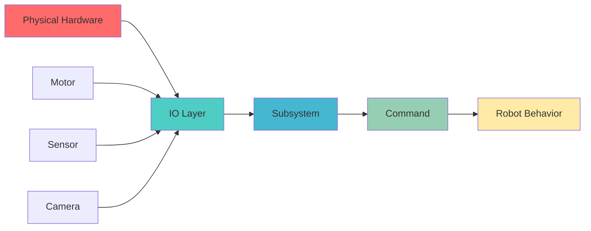
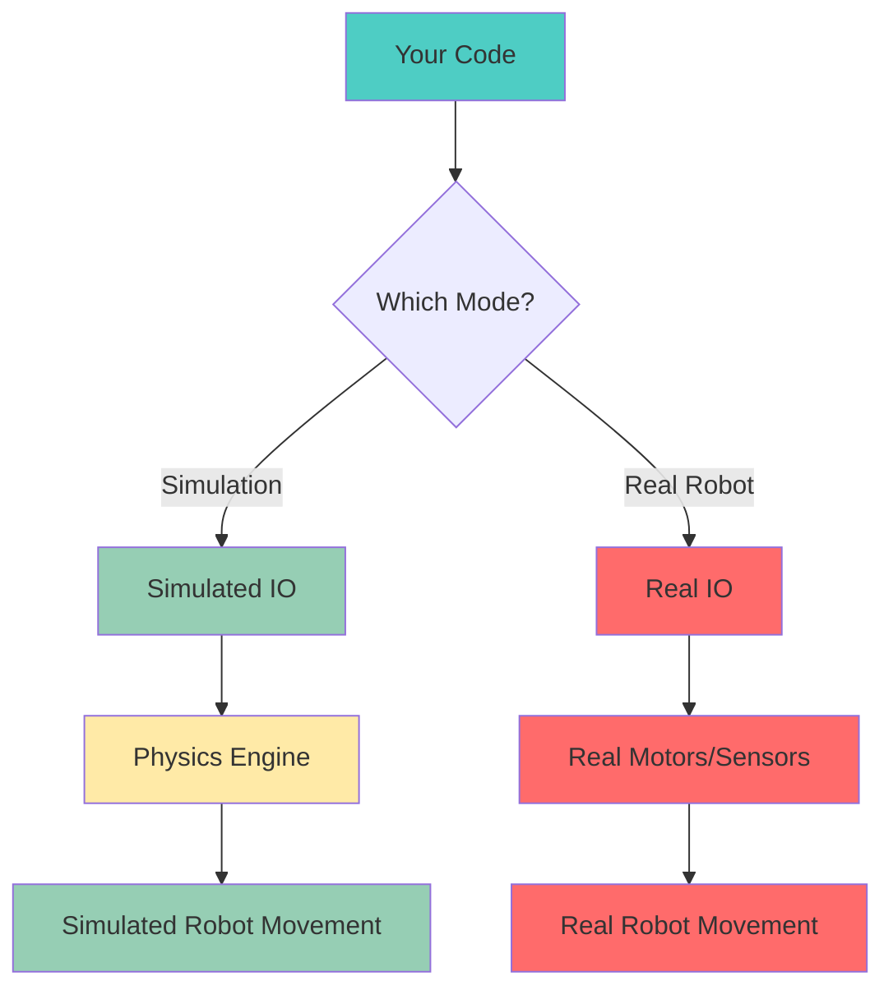
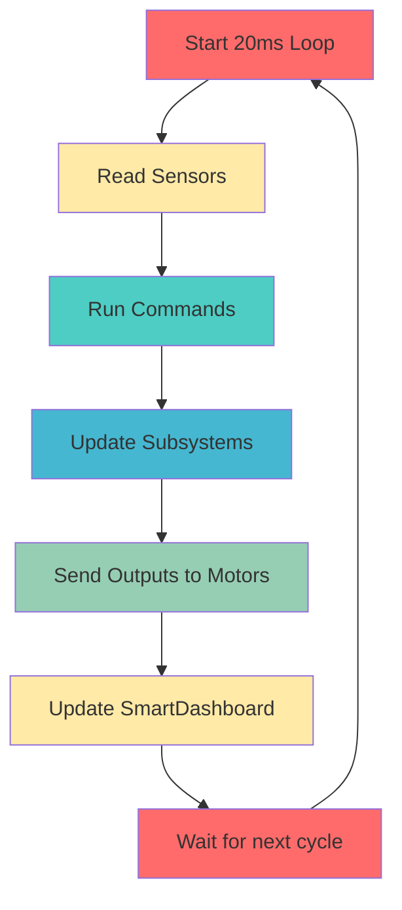
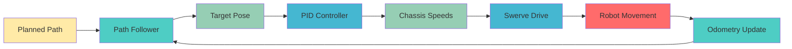

Understanding how your robot code works is easier with pictures! These diagrams show how everything connects.

## Robot Code Structure



### What This Means

- **Robot.java**: The main program that starts everything
- **RobotContainer**: Sets up all your robot's parts
- **Subsystems**: Physical parts of your robot (drivetrain, shooter, etc.)
- **Commands**: Actions your robot can do
- **Triggers**: What starts commands (buttons, timers, sensors)

## Command Execution Flow



### What This Means

1. **User Action**: You press a button or auto starts
2. **Schedule**: Command scheduler adds your command to the list
3. **Execute**: Your command runs every 20ms (50 times per second!)
4. **Check Finished**: Command asks "Am I done?"
5. **Repeat**: Until command says it's finished

## Subsystem Data Flow



### What This Means

- **Physical Hardware**: Real motors, sensors, cameras on robot
- **IO Layer**: Translates hardware into software (we handle this!)
- **Subsystem**: Uses IO data to control robot parts
- **Command**: Tells subsystems what to do
- **Robot Behavior**: What you see the robot doing

## Simulation vs Real Robot



### What This Means

**Your code stays the same!** Only the IO layer changes:

- **Simulation**: IO talks to physics engine (computer program)
- **Real Robot**: IO talks to real hardware

This is why you can test without a robot!

## Periodic Loop Timing



### What This Means

Every 20 milliseconds (that's 0.02 seconds!), your robot:

1. **Reads Sensors**: "What's happening?"
2. **Runs Commands**: "What should we do?"
3. **Updates Subsystems**: "Make it happen!"
4. **Sends Outputs**: "Turn the motors!"
5. **Updates Dashboard**: "Show driver what's happening"
6. **Waits**: "Ready for next cycle"

This happens **50 times every second!**

## Path Following Flow



### What This Means

1. **Planned Path**: "Here's where we want to go"
2. **Path Follower**: "Where should we be now?"
3. **Target Pose**: "Go to this position"
4. **PID Controller**: "How do we get there?"
5. **Chassis Speeds**: "Move this fast in this direction"
6. **Swerve Drive**: "Turn wheels to match"
7. **Robot Movement**: "We're moving!"
8. **Odometry**: "Here's where we actually are"
9. **Repeat**: "Adjust and keep going!"

## Key Takeaways

### Your Code Structure
- **Robot Container** ties everything together
- **Commands** tell **Subsystems** what to do
- **Subsystems** control physical hardware
- **IO Layer** makes testing without hardware possible

### Timing Matters
- Everything runs every **20 milliseconds**
- That's **50 times per second**
- Code must be **fast** (under 10ms ideally)

### Testing is Easy
- **Same code** works in simulation and real robot
- Only the **IO layer** changes
- Test at home without robot!

## Common Mistakes

### ❌ Wrong: Blocking in execute()
```java
@Override
public void execute() {
    Thread.sleep(1000);  // BAD! Stops whole robot!
}
```

### ✅ Right: Use timers
```java
@Override
public void execute() {
    if (Timer.getFPGATimestamp() > startTime + 1.0) {
        // Do something after 1 second
    }
}
```

### ❌ Wrong: Reading hardware directly
```java
@Override
public void periodic() {
    double position = motor.getPosition();  // Breaks simulation!
}
```

### ✅ Right: Use IO layer
```java
@Override
public void periodic() {
    double position = io.getPosition();  // Works in simulation!
}
```

---

**These diagrams help explain complex concepts simply!** Use them when teaching new team members or when you're confused about how something works.

**Want more diagrams?** Check out [Visual Guide to Subsystems](/visual-diagrams/subsystems) or [Command Flow Examples](/visual-diagrams/commands)